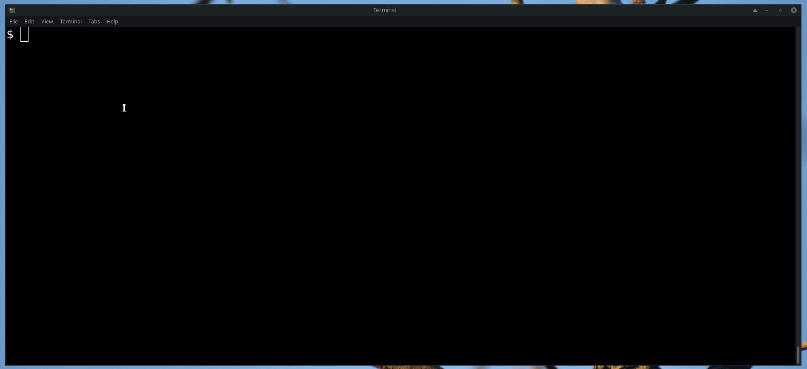

<p align="middle">
    
</p>

# QuickPcap

A quick and easy way to turn traffic generated by exploit script in to network capture (i.e. PCAP) files.

---

## Requirement

- Docker
- [nc](http://netcat.sourceforge.net/)


## Installation / Uninstallation

Please run [install](install) script before executing standalone [quickpcap.sh](quickpcap.sh) script. To remove use [uninstall](uninstall) script


## Usage message for [quickpcap.sh](quickpcap.sh) script

```
Usage: ./quickpcap.sh [-h] <protocol> <port> <input-file>
        -h         = Show this message
        protocol   = Specify 'tcp' or 'udp' (default='tcp' if not specified, optional)
        port       = TCP / UDP port to create PCAP for
        input-file = a raw request file or executable like 'poc.py'
                     executable should sends traffic to 'localhost:3333'

Example:
        './quickpcap.sh 80 poc.py'     (Creates PCAP after executing poc.py)
        './quickpcap.sh udp 53 req'    (Creates PCAP by 'cat req | nc localhost:3333')
```


## Example / Demo

QuickPcap can quickly create PCAP with [poc.py](QuickPcap/Output/CVE-2018-7856-poc.py) for [CVE-2018-7856](https://talosintelligence.com/vulnerability_reports/TALOS-2019-0767) on port `tcp/502` as shown below

The `rhost` and `rport` in [poc.py](QuickPcap/Output/CVE-2018-7856-poc.py) are changed to point to localhost:3333 as QuickPcap docker container port tcp/502 is published to localhost:3333 in this example
We can execute following command to create PCAP for the traffic generated by python exploit script

```
./quickpcap.sh tcp 502 QuickPcap/Output/CVE-2018-7865-poc.py
```



You can find the resultant PCAP [here](QuickPcap/Output/CVE-2018-7856-poc.py-tcp-502-quick.pcap)


## Implementation Details

* The main `quickpcap.sh` script is main process that handles 
    - Managing valid port argument
    - Store PCAP generated from QuickPcap to `./pcap/` using container volume
    - Acts as client to send traffic using `input-file` to `localhost:3333` 

* The `QuickPcap/qp.py` script is running in docker container that handles
    - Running Python3 based `dummy server` serving request coming in at port specified by the user (forwarded to localhost:3333) 
    - Capturing each new request coming in to the user specified port and saving PCAPs at `/PCAPS/` directory after serving each request
    - Sending `HTTP` or `non_HTTP` responses based on port specified by user
    


## Advantages

* Can be beneficial as part of automation that converts log data in to PCAPs
* Can be beneficial to create PCAP quickly from publicly available proof of concept


## Recommendations

* Please add `$USER` to `docker` group if user is not already part of `docker` group with following command
    ```
    sudo usermod $USER -aG docker
    ```

## Caution ⚠️

* QuickPcap will run script provided in argument on host system. Please make sure that there is no host based impact generated by the script
* QuickPcap is tested on Manjaro Linux and macOS only

--- 

I hope you find QuickPcap helpful 😊. Please create an issue for bugs / feedback. Enjoy 🥳


Thank you,</br>
Amit


---
